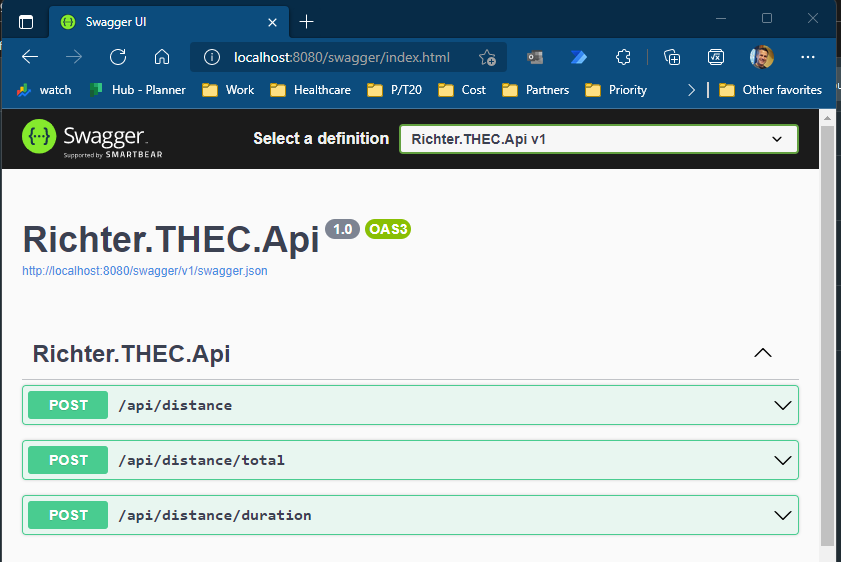
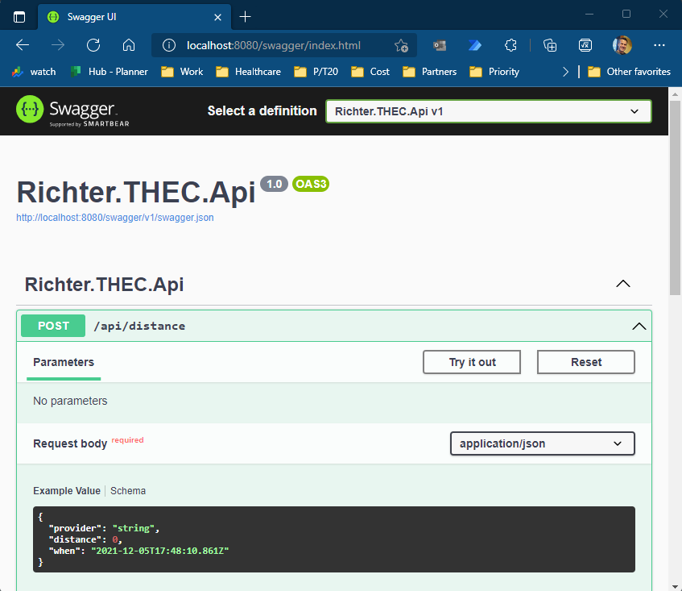
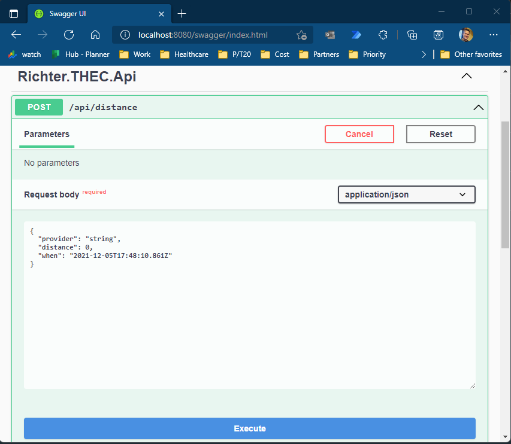

# Take Home Engineering Challenge (For Mike Richter)

## Overview
* This project is a .Net 6 Minimal Web Api.
* The API takes some ride information from the user: 
  * The provider (e.g. Yellow, Green)
  * The distance in miles (e.g. 10)
  * The date
* The API returns an array of objects that show the user the predicted duration and cost for that ride. It also shows some options for other providers and other departure times and suggests the best option from a cost perspective. 
* The API predicts the duration and the cost using ML.NET models generated from the NYC TLC Trip Record data. 
* The predictions are based on the provider, the distance of the trip, the hour of day and the day of the week. 
## Notes
* The EASIEST way to get started with building and running this project is with docker. See Build and Run section below.
* The requirement asks for Borough to Borough, but that won't reveal anything useful in terms of distance/cost. A Manhattan/Queens trip can be 10 minutes. A Brooklyn/Brooklyn trip can take an hour. 
* I am including a "distance" model. That should provide more accurate results, regardless of borough.
* Requirements call for filtering by datetime. I think a POC implementation of this would consider the time of day and the day of the week. A better model would be more granular, take into account starting location, the weather, the season, etc.
* FHV does not contain distance or cost information. Not using that data in the model.
* Using CsvHelper nuget package - not sure about the license - but this is just for POC.
* The models are not perfect, but ML.NET provides a fast way to POC the solution. I assumed that the hour of day and day of the week would impact the cost and duration, but the models I generated don't show a large impact. 
---
## Build And Run

In the `src/Richter.THEC/Richter.THEC.Api` directory run:
```
docker build -f Dockerfile -t richterthecapi ..
docker run -d -p 8080:80 --name richterthecapi --env ASPNETCORE_ENVIRONMENT=Development richterthecapi
```
(:warning: notice 2 periods '..' at the end of the build command, not one.)

You can test it using **curl**, like this
```
curl -X POST http://localhost:8080/api/distance -H 'Content-Type: application/json' -d '{"provider":"Yellow","distance":10,"when":"2021-12-05T17:29:11.670Z"}'
```
You can also test it using Swagger by visiting
```
http://localhost:8080/swagger/index.html
```


Click POST /api/distance




Click Try it out

Paste in some sample Json:
```
{
  "provider": "Green",
  "distance": 5,
  "when": "2021-12-03T17:29:11.670Z"
}
```


Click "Execute"

-----
## Projects Overview
### Richter.THEC.Data
This project is for transforming the source data into a training format for ML.NET. It also has methods that are used to transform the API's user input into a record for the prediction engine.
### Richter.THEC.Model
This project houses the ML.NET models that the API will use to return predictions.
### Richter.THEC.Api
This is a standard .NET 6 Minimal API project for exposing the application functionality.
### Richter.THEC.Tests
The projects containing all the tests. You can run the tests in the `src` directory with `dotnet test`

---
## Data Models
### Cost Data Model by Distance
* **Label**: Total
* Provider (Yellow,Green)
* Distance
* Time of Day (Hour 0-23)
* Day of the Week (0-6)
* Duration (Mins)

### Duration Data Model by Distance
* **Label**: Duration (Mins)
* Provider (Yellow,Green)
* Distance
* Time of Day (Hour 0-23)
* Day of the Week (0-6)
* Total


